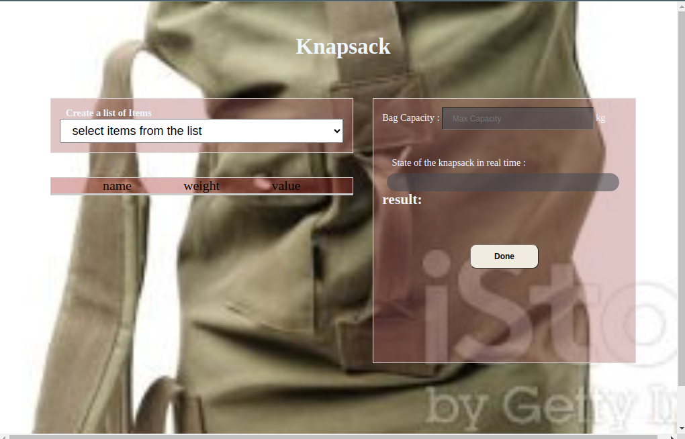

# knapsack-project

## App
 

## About

Requirements: Given a knapsack with a certain weight capacity, in this project we help fill the bag with loot from a list of items manually and checking the state of the bag in real time to achieve 
the highest value possible.
## Use
When entering the app, you have two panels. The left panel has the a select tag where you can select the item you want to add to the bag. Once the item is selected it increase the progress bar that shows the state of the filling bag in real time. When you are done , then pren the "done" button to see the return object. that object is made of the capacity of the bag, the total weight of items chosen, the list of chosen item, and the total value of the itmes selected.

## Built With :  HTML5, CSS3 and Javascript(vanilla) and as editor VScode.

### Prerequisites

Knowledge about JS:

- Basic data structures
- Arrays
- Functions
- Constructors
- 
## Clone project

- To get a local copy up and running follow these simple example steps.
- Clone this repository with `https://git@github.com:frckbrice/knapsack-project.git` using your terminal or command line.
- Change to the project directory by entering: cd knapsack-project in the terminal.

## Command line steps

- $ git clone  git@github.com:frckbrice/knapsack-project.git
- $ `cd knapsack-project `
- $ `git checkout feature

## Start App
if your are using VScode, just get to your .html file and riht click then click  Open With Live Server.

## Live Site

[Link](https://frckbrice.github.io/knapsack-project/)

## Author

👤 **Avom brice**

- GitHub: [@frckbrice](https://github.com/frckbrice)

## 🤝 Contributing

Contributions, issues, and feature requests are welcome!

## Show your support

Give a ⭐️ if you like this project!

## 📝 License (optional)

This project is [MIT](./LICENSE) licensed.

